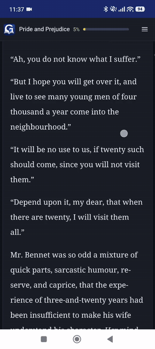

# Glosa — lector de libros con diccionario

**Pruébalo: https://glosa.dyndns.org** · Código: https://github.com/bitterfountain/glosa
(público; los diccionarios conservan las licencias de sus fuentes, ver abajo).

Lector de libros en el navegador con traducción instantánea: pulsas cualquier
palabra y aparece un popup con su traducción. Sin servidor, sin instalación,
sin cuenta: también funciona abriendo `index.html` directamente desde disco.

  

## Qué hace

- **Traducción al toque**: popup con traducciones por acepción, categoría
  gramatical, lema (houses → house), pronunciación y enlace a Wiktionary.
  Seleccionando varias palabras se traduce la frase entera (consulta online).
- **Seis idiomas**: inglés, español, italiano y alemán combinables en las 12
  direcciones; árabe como destino y como idioma de lectura (RTL, lematizador
  propio); chino como idioma de lectura (segmentación de palabras y conversión
  tradicional → simplificado).
- **Diccionarios incrustados**: 18 pares generados de WikDict, FreeDict,
  kaikki.org y CC-CEDICT, con lematización por reglas (houses → house,
  ginge → gehen, يكتب → كتب). Si una palabra no está, consulta online opcional
  (MyMemory y Wiktionary).
- **Formatos**: PDF (vista página fiel o vista texto), EPUB con imágenes,
  HTML y TXT.
- **Biblioteca**: cada libro queda guardado con portada y el punto exacto por
  el que ibas; "Continuar leyendo" en la pantalla de inicio.
- **Catálogo integrado**: Top 100 de Project Gutenberg en inglés, español,
  italiano, alemán y chino, y clásicos en árabe de Wikisource; se descargan y
  abren con un clic.
- **Cuenta opcional con Google**: sincroniza la biblioteca y la posición de
  lectura entre dispositivos y abre libros de Google Drive.
- Y además: interfaz en 4 idiomas, detección automática del idioma del libro,
  modo claro/oscuro, versión móvil, buscador, vocabulario exportable a CSV y
  atajos de teclado.

## Uso

1. Entra en https://glosa.dyndns.org (o abre `index.html` en Chrome, Edge o
   Firefox: todo funciona desde disco salvo el catálogo, que necesita el proxy
   del servidor).
2. La primera vez elige tu idioma de lectura y el idioma al que traducir (el
   segundo viene preseleccionado según tu navegador). Se cambian cuando
   quieras desde las banderas de la barra.
3. Abre un libro (PDF, EPUB, HTML o TXT), arrástralo a la ventana o elige uno
   del catálogo.
4. Pulsa una palabra. Selecciona varias para traducir la frase.

## Desarrollo

Basta un servidor estático o `php -S 127.0.0.1:8080` (con PHP, `index.php`
registra la visita y sirve `index.html`). El detalle técnico completo
(diccionarios y cómo regenerarlos, lematización, estructura del código,
cuenta de Google, contador de visitas, gotchas) está en
[docs/detalles.md](docs/detalles.md).

## Licencias y créditos

- Código de Glosa: © leukasoft (licencia por decidir; mientras tanto, todos los derechos reservados).
- pdf.js (Apache 2.0), JSZip (MIT).
- Diccionarios: WikDict (Wiktionary vía DBnary, CC BY-SA 3.0), FreeDict (GPL),
  kaikki.org (Wiktionary, CC BY-SA 4.0). Los ficheros `dict/*.js` derivan de ellos y
  heredan sus licencias.
- Consulta online: MyMemory y Wiktionary. Libros: Project Gutenberg.
- Tabla IP → país: geo-whois-asn-country (sapics/ip-location-db, PDDL / dominio público).
- Chino: CC-CEDICT (MDBG, CC BY-SA 4.0). Árabe: kaikki.org (CC BY-SA 4.0), FreeDict (GPL).
