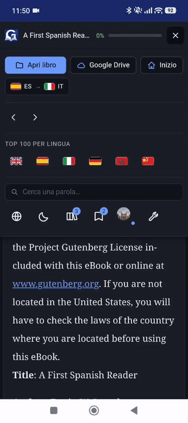
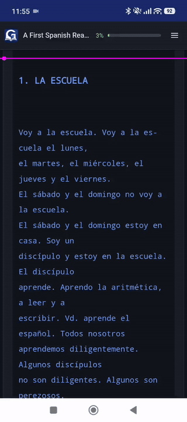

# Glosa — a book reader with a built-in dictionary

**Try it: https://glosa.dyndns.org** · Code: https://github.com/bitterfountain/glosa
(public; the dictionaries keep the licenses of their sources, see below).

A book reader that runs in the browser with instant translation: tap any word
and a popup shows its translation. No server, no install, no account: it also
works by opening `index.html` straight from disk.

<table align="center">
  <tr>
    <td align="center"></td>
    <td align="center"></td>
    <td align="center"></td>
  </tr>
  <tr>
    <td align="center">Reading in English, translating into Spanish</td>
    <td align="center">Reading in German, translating into Spanish</td>
    <td align="center">Reading in Spanish, translating into English</td>
  </tr>
</table>

## What it does

- **Tap to translate**: popup with translations by sense, part of speech,
  lemma (houses → house), pronunciation and a link to Wiktionary. Select
  several words to translate the whole phrase (online lookup).
- **Six languages**: English, Spanish, Italian and German in all 12
  directions; Arabic as target and as reading language (RTL, custom
  lemmatizer); Chinese as reading language (word segmentation and
  traditional → simplified conversion).
- **Embedded dictionaries**: 18 language pairs built from WikDict, FreeDict,
  kaikki.org and CC-CEDICT, with rule-based lemmatization (houses → house,
  ginge → gehen, يكتب → كتب). If a word is missing, optional online lookup
  (MyMemory and Wiktionary).
- **Formats**: PDF (faithful page view or text view), EPUB with images, HTML
  and TXT.
- **Library**: every book is saved with its cover and the exact spot you were
  at; "Continue reading" on the home screen.
- **Built-in catalog**: Project Gutenberg's Top 100 in English, Spanish,
  Italian, German and Chinese, plus Arabic classics from Wikisource; they
  download and open with one click.
- **Optional Google account**: syncs the library and reading position across
  devices and opens books from Google Drive.
- Also: UI in 4 languages, automatic detection of the book's language,
  light/dark mode, mobile version, search, vocabulary export to CSV and
  keyboard shortcuts.

## Usage

1. Go to https://glosa.dyndns.org (or open `index.html` in Chrome, Edge or
   Firefox: everything works from disk except the catalog, which needs the
   server proxy).
2. The first time, pick your reading language and the language to translate
   into (the latter is preselected from your browser). You can change them
   any time from the flags in the toolbar.
3. Open a book (PDF, EPUB, HTML or TXT), drag it onto the window or pick one
   from the catalog.
4. Tap a word. Select several to translate the phrase.

## Development

Any static server will do, or `php -S 127.0.0.1:8080` (with PHP, `index.php`
logs the visit and serves `index.html`). The full technical reference
(dictionaries and how to rebuild them, lemmatization, code structure, Google
account, visit counter, gotchas) is in [docs/detalles.md](docs/detalles.md)
(in Spanish).

## Licenses and credits

- Glosa code: © leukasoft (license to be decided; all rights reserved in the meantime).
- pdf.js (Apache 2.0), JSZip (MIT).
- Dictionaries: WikDict (Wiktionary via DBnary, CC BY-SA 3.0), FreeDict (GPL),
  kaikki.org (Wiktionary, CC BY-SA 4.0). The `dict/*.js` files derive from them
  and inherit their licenses.
- Online lookup: MyMemory and Wiktionary. Books: Project Gutenberg.
- IP → country table: geo-whois-asn-country (sapics/ip-location-db, PDDL / public domain).
- Chinese: CC-CEDICT (MDBG, CC BY-SA 4.0). Arabic: kaikki.org (CC BY-SA 4.0), FreeDict (GPL).
